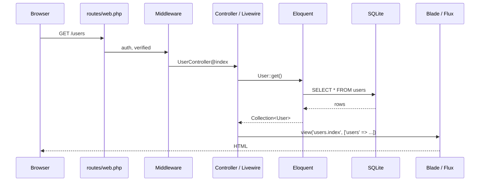

# Architecture Overview

A bird's-eye view of how this Laravel 13 + Livewire 4 application is put
together. The goal is for trainees to know **where things live** and
**how a request becomes a response**.

## Table of Contents

- [Tech Stack at a Glance](#tech-stack-at-a-glance)
- [Directory Layout](#directory-layout)
- [Request Lifecycle](#request-lifecycle)
- [Application Layers](#application-layers)
- [What's Already Built](#whats-already-built)
- [What's Intentionally Incomplete](#whats-intentionally-incomplete)

## Tech Stack at a Glance

| Concern | Choice |
|---------|--------|
| HTTP framework | Laravel 13 |
| UI rendering | Livewire 4 (full-page components and partials) |
| UI components | Flux UI 2 |
| Styles | Tailwind CSS 4 |
| Auth backend | Laravel Fortify |
| Passwordless login | Fortify Passkeys |
| Two-factor | Fortify Two-Factor |
| Frontend bundler | Vite 7 |
| Tests | Pest 4 |
| Default DB | SQLite |

## Directory Layout

```text
graduation/
├── app/
│   ├── Actions/Fortify/      # Fortify customisation hooks
│   ├── Concerns/             # Reusable traits
│   ├── Console/              # Artisan commands
│   ├── Http/Controllers/     # Plain controllers (e.g. UserController)
│   ├── Livewire/
│   │   ├── Actions/          # Reusable Livewire actions (Logout, ...)
│   │   └── Settings/         # Settings page Livewire components
│   ├── Models/               # Eloquent models
│   └── Providers/            # Service providers
├── bootstrap/                # App bootstrap & providers
├── config/                   # Framework + package config
├── database/
│   ├── migrations/           # Schema migrations
│   ├── factories/            # Model factories (for tests / seeders)
│   ├── seeders/              # DB seeders
│   └── database.sqlite       # Local SQLite DB
├── public/                   # Web root
├── resources/
│   ├── css/                  # Tailwind entry
│   ├── js/                   # JS entry
│   └── views/                # Blade + Livewire + Flux templates
├── routes/
│   ├── web.php               # Public + authed routes
│   ├── settings.php          # Settings routes (mounted from web.php)
│   └── console.php           # Artisan closures
└── tests/                    # Pest test suites
    ├── Feature/              # HTTP / Livewire feature tests
    └── Unit/                 # Pure unit tests
```

## Request Lifecycle

A simplified view of how a request flows through the app:



For Livewire pages mounted via `Route::livewire(...)`, the controller step
is replaced by the Livewire component class (e.g. `App\Livewire\Settings\Profile`).

## Application Layers

| Layer | Where | Responsibility |
|-------|-------|----------------|
| Routing | `routes/web.php`, `routes/settings.php` | Map URLs → controllers / Livewire components. |
| Controllers | `app/Http/Controllers/` | Thin HTTP handlers for resource routes. |
| Livewire | `app/Livewire/` | Stateful UI components — profile, security, appearance, logout. |
| Models | `app/Models/` | Eloquent models — currently only `User`. |
| Fortify Actions | `app/Actions/Fortify/` | Customisation points for register/reset/update flows. |
| Views | `resources/views/` | Blade templates, Livewire partials, Flux UI usage. |

## What's Already Built

The starter kit ships with these working features:

- **Authentication** — register, login, logout, email verification.
- **Two-Factor Authentication** — TOTP + recovery codes (Fortify).
- **Passkeys** — passwordless login via WebAuthn (Fortify Passkeys).
- **Settings pages** — profile, security, appearance (Livewire components).
- **Dashboard** — placeholder home for authed users.
- **Users resource** — index, create, show, edit views and routes scaffolded.

## What's Intentionally Incomplete

Trainees will finish these as part of the programme:

- `UserController@store`, `update`, `destroy` are stubs — see
  [04-training/03-exercises.md](../04-training/03-exercises.md).
- Form Requests for user create / update are not yet created.
- No tests cover the users resource yet.

## See Also

- [Patterns](02-patterns.md) — the conventions used across these layers.
- [Data Layer](03-data-layer.md) — models, migrations, and factories.
