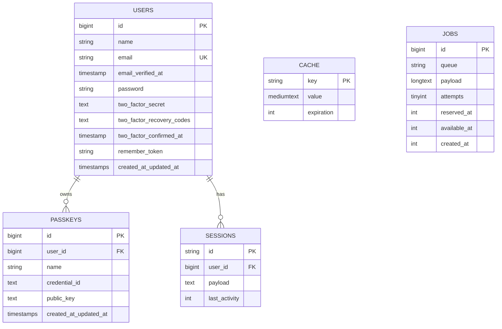

# Data Layer

Database schema, models, factories, and seeders.

## Table of Contents

- [Database Engine](#database-engine)
- [Schema Overview](#schema-overview)
- [Migrations](#migrations)
- [Models](#models)
- [Factories & Seeders](#factories--seeders)
- [Common Tasks](#common-tasks)

## Database Engine

| Environment | Driver |
|-------------|--------|
| Local / training | SQLite (`database/database.sqlite`) |
| Tests | SQLite in-memory (via `phpunit.xml`) |
| Production-ish | Trainees may switch to MySQL / Postgres — see `.env.example` |

SQLite keeps the dev loop fast and removes the need to install a DB
server during training.

## Schema Overview



## Migrations

The shipped migrations under `database/migrations/`:

| Migration | What it does |
|-----------|--------------|
| `0001_01_01_000000_create_users_table.php` | `users`, `password_reset_tokens`, `sessions` tables. |
| `0001_01_01_000001_create_cache_table.php` | `cache` + `cache_locks` tables. |
| `0001_01_01_000002_create_jobs_table.php` | `jobs`, `job_batches`, `failed_jobs` tables. |
| `2024_01_01_000000_create_passkeys_table.php` | `passkeys` table (Fortify Passkeys). |
| `2025_08_14_170933_add_two_factor_columns_to_users_table.php` | Adds 2FA columns to `users`. |

Run migrations:

```bash
php artisan migrate          # apply pending migrations
php artisan migrate:fresh    # drop all, re-run from scratch (LOCAL ONLY)
php artisan migrate:rollback # roll back the last batch
```

## Models

Currently only **one** Eloquent model: `App\Models\User`.

```php
#[Fillable(['name', 'email', 'password'])]
#[Hidden(['password', 'two_factor_secret', 'two_factor_recovery_codes', 'remember_token'])]
class User extends Authenticatable implements PasskeyUser
{
    use HasFactory, Notifiable, PasskeyAuthenticatable, TwoFactorAuthenticatable;

    protected function casts(): array
    {
        return [
            'email_verified_at' => 'datetime',
            'password' => 'hashed',
        ];
    }

    public function initials(): string { /* ... */ }
}
```

Key points:

- Implements `PasskeyUser` and uses the `PasskeyAuthenticatable` +
  `TwoFactorAuthenticatable` traits — provided by Fortify.
- `password` is auto-hashed via the `hashed` cast — never call
  `Hash::make()` yourself when assigning.
- `initials()` is a small helper used by the navbar avatar.

## Factories & Seeders

- Factories: `database/factories/` — there's a `UserFactory` already.
- Seeders: `database/seeders/` — `DatabaseSeeder` is the entry point
  (`php artisan db:seed`).

Trainees will write factories + seeders for new models as part of the
[exercises](../04-training/03-exercises.md).

## Common Tasks

| Task | Command |
|------|---------|
| Create a new migration | `php artisan make:migration create_posts_table` |
| Create a new model + migration + factory | `php artisan make:model Post -mf` |
| Run migrations | `php artisan migrate` |
| Reset and re-seed | `php artisan migrate:fresh --seed` |
| Open Tinker REPL | `php artisan tinker` |
| Browse SQLite | Open `database/database.sqlite` in DB Browser / TablePlus |
