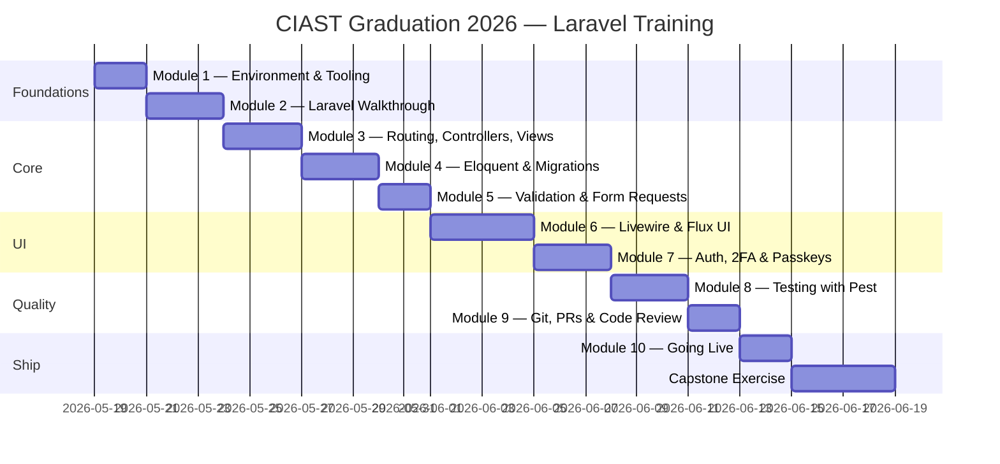

# Syllabus

The shape of the CIAST Graduation 2026 Laravel training programme.

## Table of Contents

- [Outcomes](#outcomes)
- [Audience & Prerequisites](#audience--prerequisites)
- [Programme Shape](#programme-shape)
- [Evaluation](#evaluation)
- [Tooling Trainees Will Use](#tooling-trainees-will-use)

## Outcomes

By the end of the programme, trainees should be able to:

1. Set up a Laravel 13 project from scratch and from a starter kit.
2. Read and explain a Laravel codebase — routes, controllers, models,
   views, Livewire components.
3. Implement a feature end-to-end: migration → model → controller →
   view → test.
4. Write Form Requests for validation and Action classes for business logic.
5. Build interactive UI using Livewire 4 and Flux UI.
6. Customise authentication flows via Fortify (incl. 2FA & Passkeys).
7. Write Pest feature and unit tests, including Livewire interaction tests.
8. Use Git and GitHub for collaborative development (branches, PRs, reviews).
9. Deploy a Laravel app to a public environment.

## Audience & Prerequisites

| Trainee profile | Expectation |
|-----------------|-------------|
| Background | Recent graduates / fresh developers entering web dev. |
| PHP | Comfortable with PHP basics — variables, arrays, functions, classes. |
| HTML/CSS | Can write basic markup; Tailwind familiarity helpful but not required. |
| JS | Basic understanding; deep JS not required (Livewire abstracts most of it). |
| Git | Knows `clone`, `commit`, `push`, `pull` at minimum. |
| OS | macOS, Linux, or Windows (with WSL2 recommended). |

## Programme Shape

A suggested cadence — adjust to match the actual delivery calendar:

## Evaluation

| Component | Weight | Notes |
|-----------|--------|-------|
| Module exercises | 50% | One submission per module via PR. |
| Test coverage | 15% | Every PR must add at least one Pest test. |
| Code quality | 15% | Pint clean, idiomatic Laravel patterns. |
| Capstone project | 20% | A small feature shipped end-to-end with deploy. |

Facilitators leave review comments on each PR; trainees address them
before the next module.

## Tooling Trainees Will Use

| Tool | Purpose |
|------|---------|
| Editor | VS Code (with PHP Intelephense + Laravel extensions) or PhpStorm. |
| Terminal | The shell of your choice. |
| Git client | CLI is fine; GUIs (Fork, GitKraken, GitHub Desktop) allowed. |
| Database GUI | TablePlus, DB Browser for SQLite, or Sequel Ace. |
| API client | Bruno, Insomnia, or Postman (for testing routes manually). |
| Browser | Chrome / Firefox with devtools open. |
