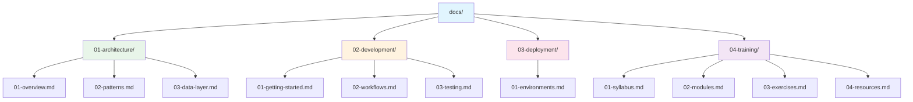

# CIAST Graduation Training — Documentation

[](https://laravel.com)
[](https://www.php.net)
[](https://livewire.laravel.com)
[](https://fluxui.dev)
[](https://tailwindcss.com)
[](https://pestphp.com)
[](https://opensource.org/licenses/MIT)

Hands-on Laravel training project for the **CIAST Graduation 2026** cohort.
Built on the official **Laravel Livewire Starter Kit** so trainees can learn
modern Laravel by extending a real, production-shaped codebase.

## Table of Contents

- [About This Training](#about-this-training)
- [Quick Start](#quick-start)
- [Documentation Map](#documentation-map)
- [Learning Path](#learning-path)
- [Project Stack](#project-stack)
- [Conventions](#conventions)

## About This Training

This repository is the working codebase for trainees during the CIAST
graduation programme. It demonstrates a complete, opinionated Laravel
application — authentication, two-factor, passkeys, settings, and a
basic users CRUD — and is intentionally **left incomplete** in spots so
trainees can finish features as exercises.

See [`04-training/`](04-training/README.md) for the syllabus, modules,
and exercise list.

## Quick Start

```bash
# 1. Install dependencies
composer install
npm install

# 2. Configure environment
cp .env.example .env
php artisan key:generate

# 3. Set up the database (SQLite by default)
touch database/database.sqlite
php artisan migrate

# 4. Run the dev stack (server + queue + logs + vite)
composer dev
```

Open <http://localhost:8000> and register an account to start exploring.

Full setup details: [`02-development/01-getting-started.md`](02-development/01-getting-started.md).

## Documentation Map



| Section | Purpose |
|---------|---------|
| [01-architecture](01-architecture/README.md) | How the app is structured — request flow, layers, patterns, data model. |
| [02-development](02-development/README.md) | Local setup, daily workflow, and testing. |
| [03-deployment](03-deployment/README.md) | Environments and deployment notes. |
| [04-training](04-training/README.md) | Syllabus, training modules, exercises, and reference material. |

## Learning Path

Recommended reading order for trainees:

1. [Getting Started](02-development/01-getting-started.md) — get the app running.
2. [Architecture Overview](01-architecture/01-overview.md) — understand the layout.
3. [Training Syllabus](04-training/01-syllabus.md) — see the full programme.
4. [Modules](04-training/02-modules.md) — work through each module.
5. [Exercises](04-training/03-exercises.md) — apply what you've learned.
6. [Testing](02-development/03-testing.md) — write Pest tests for your changes.

## Project Stack

| Layer | Technology |
|-------|-----------|
| Language | PHP 8.3+ |
| Framework | Laravel 13 |
| Frontend | Livewire 4 + Flux UI 2 + Tailwind CSS 4 |
| Auth | Laravel Fortify (with Passkeys + 2FA) |
| Build | Vite 7 |
| Testing | Pest 4 + Pest Plugin Laravel |
| Database | SQLite (dev) — Migrations only |
| Tooling | Laravel Pint, Pail, Sail, Tinker |

## Conventions

- Branch naming, commit style, and PR flow: see [02-development/02-workflows.md](02-development/02-workflows.md).
- Code style enforced by **Laravel Pint** — run `composer lint` before
  committing.
- Tests must pass before merging — `composer test`.
- Trainees should follow the exercise spec in `04-training/03-exercises.md`
  and submit work as pull requests against `main`.

---

Maintained by the CIAST training facilitators. Contributions from trainees welcome.
